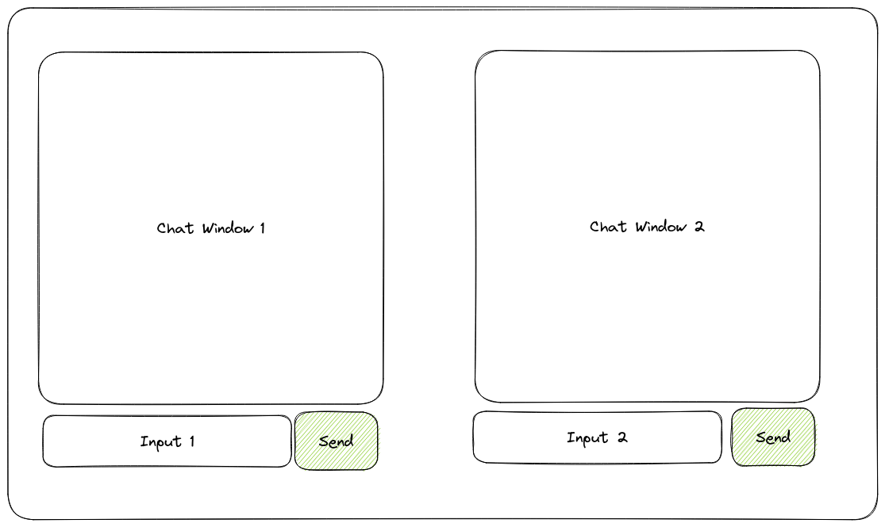
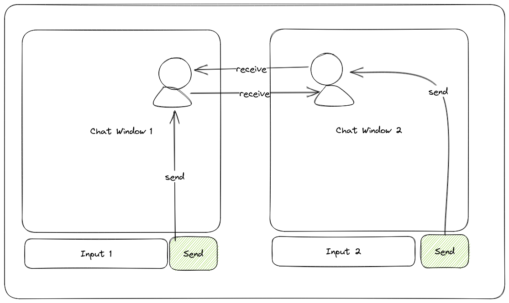
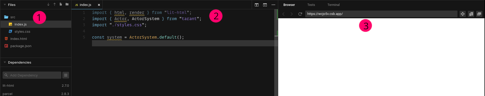
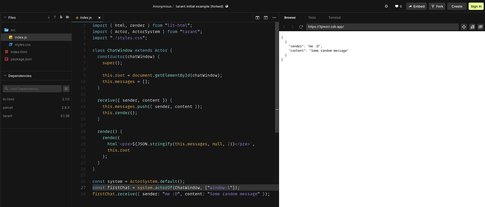
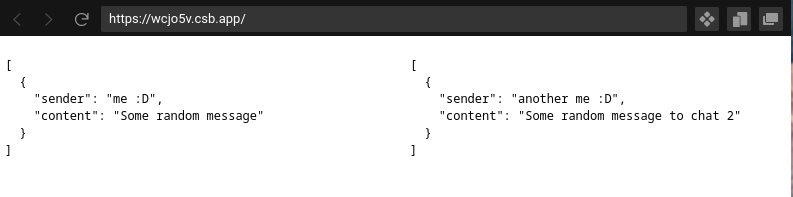
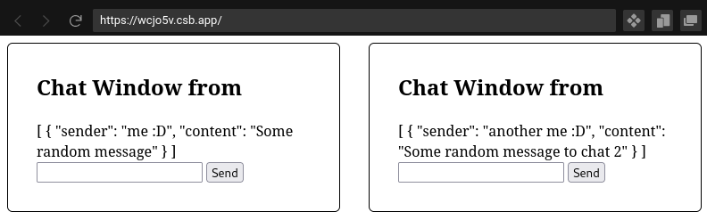
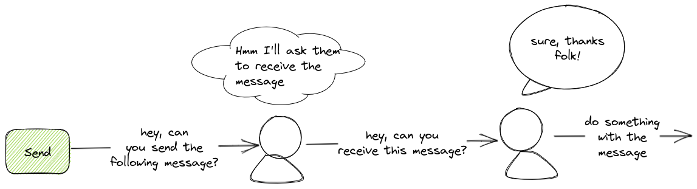
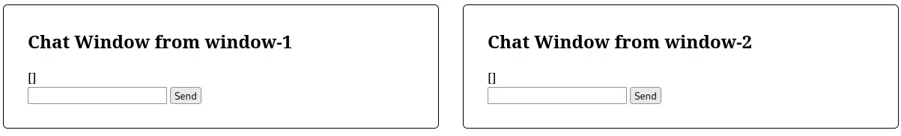

# Tutorial: A Chat Application

We are going to build a simple chat application during this tutorial. The chat application will use basic JavaScript in the browser with [Lit](https://lit.dev/).
This concrete example will use [lit-html](https://lit.dev/docs/libraries/standalone-templates/) which is able to render HTML without any specific convention.

How the chat is going to work is relatively simple. We will have a window with two text boxes and two chat blocks. Every time we write in a chat box, the message
will be sent to the other chat window:



## Before we start

This tutorial assumes that you already know the basic theory of tarant and the actor model. You can read the basics in [Thinking in Tarant](./thinking-in-tarant).

## What are you building

In this tutorial you will be building an interactive chat that runs on the same browser. There won't be any network connectivity outside (to simplify). It will look like:

<iframe src="https://codesandbox.io/embed/tarant-chat-complete-example-vdwk96?fontsize=14&hidenavigation=1&theme=dark&view=preview"
     style={{ width: "100%", height: "500px", border: "0", borderRadius: "4px", overflow: "hidden"}}
     title="lucid-pateu-vdwk96"
     allow="accelerometer; ambient-light-sensor; camera; encrypted-media; geolocation; gyroscope; hid; microphone; midi; payment; usb; vr; xr-spatial-tracking"
     sandbox="allow-forms allow-modals allow-popups allow-presentation allow-same-origin allow-scripts"
></iframe>

Feel free to interact with the application and understand how it behaves as this tutorial will guide you on how to build it.

## The Architecture

In tarant, it is common to map components to actors. Each component, at the end, has it's own lifecycle, state and behaviour, and you want it to be isolated and
transactional. As we are going to have two big components (both chat windows), we can create one single Actor and create two instances of the actor.



## Setup for the tutorial

During this tutorial, we will be using CodeSandbox, so you don't need to prepare a local environment to start playing with tarant. To open the tutorial,
click on the following button:

<a href="https://codesandbox.io/s/tarant-initial-example-wcjo5v?editorsize=50&fontsize=14&hidenavigation=1&runonclick=1" method="GET" target="_blank">
<button class="button button--primary">
<svg width="1em" height="1em" style={{ marginLeft: "4px", marginRight: "4px", marginTop: "0.5em", padding: "0" }} viewBox="0 0 24 24" fill="none" xmlns="http://www.w3.org/2000/svg"> <path d="M20.5001 2H15.5001C15.3675 2 15.2403 2.05268 15.1465 2.14645C15.0528 2.24021 15.0001 2.36739 15.0001 2.5V3.5C15.0001 3.63261 15.0528 3.75979 15.1465 3.85355C15.2403 3.94732 15.3675 4 15.5001 4H18.5901L7.6501 14.94C7.60323 14.9865 7.56604 15.0418 7.54065 15.1027C7.51527 15.1636 7.5022 15.229 7.5022 15.295C7.5022 15.361 7.51527 15.4264 7.54065 15.4873C7.56604 15.5482 7.60323 15.6035 7.6501 15.65L8.3501 16.35C8.39658 16.3969 8.45188 16.4341 8.51281 16.4594C8.57374 16.4848 8.63909 16.4979 8.7051 16.4979C8.7711 16.4979 8.83646 16.4848 8.89738 16.4594C8.95831 16.4341 9.01362 16.3969 9.0601 16.35L20.0001 5.41V8.5C20.0001 8.63261 20.0528 8.75979 20.1465 8.85355C20.2403 8.94732 20.3675 9 20.5001 9H21.5001C21.6327 9 21.7599 8.94732 21.8537 8.85355C21.9474 8.75979 22.0001 8.63261 22.0001 8.5V3.5C22.0001 3.10218 21.8421 2.72064 21.5608 2.43934C21.2795 2.15804 20.8979 2 20.5001 2V2Z" fill="currentColor"></path><path d="M21.5 13H20.5C20.3674 13 20.2402 13.0527 20.1464 13.1464C20.0527 13.2402 20 13.3674 20 13.5V20H4V4H10.5C10.6326 4 10.7598 3.94732 10.8536 3.85355C10.9473 3.75979 11 3.63261 11 3.5V2.5C11 2.36739 10.9473 2.24021 10.8536 2.14645C10.7598 2.05268 10.6326 2 10.5 2H3.5C3.10218 2 2.72064 2.15804 2.43934 2.43934C2.15804 2.72064 2 3.10218 2 3.5V20.5C2 20.8978 2.15804 21.2794 2.43934 21.5607C2.72064 21.842 3.10218 22 3.5 22H20.5C20.8978 22 21.2794 21.842 21.5607 21.5607C21.842 21.2794 22 20.8978 22 20.5V13.5C22 13.3674 21.9473 13.2402 21.8536 13.1464C21.7598 13.0527 21.6326 13 21.5 13Z" fill="currentColor"></path></svg>
Fork CodeSandbox
</button>
</a>

<div class="alert alert--primary" style={{"margin-top": "1em", "margin-bottom": "1em", "padding-bottom": "4px"}} role="alert">

  **You can also develop applications with tarant locally.** You need to download [Node.js](https://nodejs.org/en/). Before continuing, install the 
  latest stable version for your operating system.

  1. Now, you can download the tutorial by clicking the in the following button:

  <a href="https://codesandbox.io/s/tarant-initial-example-wcjo5v?editorsize=50&fontsize=14&hidenavigation=1&runonclick=1" method="GET" target="_blank">
    <button class="button button--primary">
    <svg width="1em" height="1em" style={{ marginLeft: "4px", marginRight: "4px", marginTop: "0.5em", padding: "0" }} viewBox="0 0 24 24" fill="none" xmlns="http://www.w3.org/2000/svg"> <path d="M20.5001 2H15.5001C15.3675 2 15.2403 2.05268 15.1465 2.14645C15.0528 2.24021 15.0001 2.36739 15.0001 2.5V3.5C15.0001 3.63261 15.0528 3.75979 15.1465 3.85355C15.2403 3.94732 15.3675 4 15.5001 4H18.5901L7.6501 14.94C7.60323 14.9865 7.56604 15.0418 7.54065 15.1027C7.51527 15.1636 7.5022 15.229 7.5022 15.295C7.5022 15.361 7.51527 15.4264 7.54065 15.4873C7.56604 15.5482 7.60323 15.6035 7.6501 15.65L8.3501 16.35C8.39658 16.3969 8.45188 16.4341 8.51281 16.4594C8.57374 16.4848 8.63909 16.4979 8.7051 16.4979C8.7711 16.4979 8.83646 16.4848 8.89738 16.4594C8.95831 16.4341 9.01362 16.3969 9.0601 16.35L20.0001 5.41V8.5C20.0001 8.63261 20.0528 8.75979 20.1465 8.85355C20.2403 8.94732 20.3675 9 20.5001 9H21.5001C21.6327 9 21.7599 8.94732 21.8537 8.85355C21.9474 8.75979 22.0001 8.63261 22.0001 8.5V3.5C22.0001 3.10218 21.8421 2.72064 21.5608 2.43934C21.2795 2.15804 20.8979 2 20.5001 2V2Z" fill="currentColor"></path><path d="M21.5 13H20.5C20.3674 13 20.2402 13.0527 20.1464 13.1464C20.0527 13.2402 20 13.3674 20 13.5V20H4V4H10.5C10.6326 4 10.7598 3.94732 10.8536 3.85355C10.9473 3.75979 11 3.63261 11 3.5V2.5C11 2.36739 10.9473 2.24021 10.8536 2.14645C10.7598 2.05268 10.6326 2 10.5 2H3.5C3.10218 2 2.72064 2.15804 2.43934 2.43934C2.15804 2.72064 2 3.10218 2 3.5V20.5C2 20.8978 2.15804 21.2794 2.43934 21.5607C2.72064 21.842 3.10218 22 3.5 22H20.5C20.8978 22 21.2794 21.842 21.5607 21.5607C21.842 21.2794 22 20.8978 22 20.5V13.5C22 13.3674 21.9473 13.2402 21.8536 13.1464C21.7598 13.0527 21.6326 13 21.5 13Z" fill="currentColor"></path></svg>
    Fork CodeSandbox
    </button>
  </a>

  2. In the opened CodeSandbox tab, navigate to `Top Left Menu > File > Export To ZIP`.
  3. Decompress the ZIP File you just downloaded.
  4. Navigate to the new folder using the terminal and run the following command:
  ```sh
  npm i
  ```
  5. To start the development environment, run the following command:
  ```sh
  npm start
  ```

</div>

### The Development Environment

When you clicked on the Fork button, it opened a new tab with a CodeSandbox environment. It has everything you need to start coding. You'll see something similar to this:



1. This is the folder structure of the project. All files will be stored there. For example, `index.html` is the root page of the project. `index.js` is where your JavaScript code will be living. You will be working in the JavaScript file.
2. This is the current open file. You will be able to modify the code here.
3. This is the preview. Every time you change the JavaScript file, your changes will be shown here,

Now, open the `index.js` file by clicking on it. If it's not visible in the panel, click on the `src` folder to open it, and you'll be able to see the `index.js` file.
Essentially, this is your application! Let's go line by line on the code:

```js
import { html, render } from "lit-html"; // (1)
import { Actor, ActorSystem } from "tarant"; // (2)
import "./styles.css"; // (3)

const system = ActorSystem.default(); // (4)
```

1. This is what we call an `import` statement. It allows you to import a dependency. Here, we are importing the `lit-html` library, that will
allows us to render our components.
2. This is another `import` statement, but this time we are importing `tarant`'s Actor and ActorSystem classes.
3. This is another `import` statement, that allows `Parcel` to import the CSS styles into the final bundle.
4. This line creates an ActorSystem with the default configuration.

An ActorSystem is where all our actors are going to live. Actors are tied to the actor system, and allows us to interact easily with them. Right now,
our actor system does not contain any actor, but we will fix that later.

## The ChatWindow Actor

Now we are going to create our first actor. If you remember the diagram we did before, the actor is going to represent the chat window, that contains
both the chat box (where all our messages are going to be rendered), the input box and the button that we will use to send messages to the next chat window.


However, we are going to start with baby steps. We will create an actor called ChatWindow that will hold an array of messages. Actors look like ordinary classes,
but they extend from Actor.

```js
class ChatWindow extends Actor {

}
```

To initialise an actor, we use the constructor, as we would do with any ordinary JavaScript class. However, as we are inheriting actor, we need to call the `super` 
constructor.

```js
class ChatWindow extends Actor {
  constructor() {
    super()
  }
}
```

After the `super` call, we can initialise the actor state. Let's start with an empty array of messages.

```js
class ChatWindow extends Actor {
  constructor() {
    super()

    this.messages = []
  }
}
```

In tarant, all properties are private to the actor. Even actors of the same type can not see the properties of other actors. This is called instance-private
properties. Only the actor that owns it's properties can see them. This is required to ensure that consumers of the data do not read partial information.

Now, let's create an instance of our actor. 

To create an instance of an actor we use the `ActorSystem.actorOf(className, constructorParameters)` factory method. It will return a new actor of the specified
type. At the bottom of the file, add the following line:

```js
const firstChat = system.actorOf(ChatWindow, []);
```

This will create a new ChatWindow actor and store it in a variable called firstChat. Now we should be able to interact with the actor!

However, there is no behaviour in the actor yet. To add new behaviour we implement `methods`, as ordinary JavaScript methods. Let's create a new method called
`receive` that will receive a new message from a sender:

```js
class ChatWindow extends Actor {
  constructor() {
    super()

    this.messages = []
  }

  receive({ sender, content }) {
    this.messages.push({ sender, content });
  }
}
```

Now we can interact with our actor by sending it a message.

```js
const firstChat = system.actorOf(ChatWindow, []);
firstChat.receive({ sender: 'me :D', content: 'Some random message' })
```

Now, nothing seems to happen, but the actor got a new message and stored it into an array. Let's do something so we can see the result!

## First iteration: rendering the actor

Your index.js file should look like this now:

```js
import { html, render } from "lit-html";
import { Actor, ActorSystem } from "tarant";
import "./styles.css";

class ChatWindow extends Actor {
  constructor() {
    super()

    this.messages = []
  }

  receive({ sender, content }) {
    this.messages.push({ sender, content });
  }
}

const system = ActorSystem.default();
const firstChat = system.actorOf(ChatWindow, []);
firstChat.receive({ sender: 'me :D', content: 'Some random message' })
```

The issue is that, right now, we can't see the messages of our actor! Let's do a first, ugly step, to render them. We will beautify them a bit later.

If you open the `index.html` file you will see with have two divs, with two ids:

```html
<!DOCTYPE html>
<html>
  <head>
    <title>Tarant Chat</title>
    <meta charset="UTF-8" />
  </head>
  <body>
    <div id="window-1"></div> <!-- We will render our actor here! -->
    <div id="window-2"></div>
  </body>
  <script src="src/index.js"></script>
</html>
```

We will render our actor inside the `window-1` div. To do so, we need to tell our actor where to render. The simplest way is by passing a parameter to the
actor constructor.

```js
class ChatWindow extends Actor {
  constructor(chatWindow) { // <-- chatWindow here is the first element of the array
    super()

    this.root = document.getElementById(chatWindow);
    this.messages = []
  }

  receive({ sender, content }) {
    this.messages.push({ sender, content });
  }
}

const firstChat = system.actorOf(ChatWindow, [ 'window-1' ]); // 'window-1' is the chatWindow parameter in the constructor
```

With this small change, now we have a reference to the DOM element where the actor is going to render. However, this is not enough, now we want to render it.
This means, that we need to tell the actor how it's state is going to become HTML. To do so, we will create a new method `render`, that will get the actor
state and render it into the root DOM element.

```js
class ChatWindow extends Actor {
  constructor(chatWindow) { // <-- chatWindow here is the first element of the array
    super()

    this.root = document.getElementById(chatWindow);
    this.messages = []
  }

  receive({ sender, content }) {
    this.messages.push({ sender, content });
  }

  render() {
    render(html`<pre>${JSON.stringify(this.messages, null, 2)}</pre>`, this.root)
  }
}
```

Now we are going to render some ugly JSON with the state of the actor. However, with these changes, nothing is yet rendered in the browser. This is
because tarant is not a frontend framework: even if we have some integrations like with [Vue](docs/Modules/tarant-vue) that can take care of the
complexities of rendering, now we are not using any of them.

To start rendering, we will need to tell the actor to render every time we receive a message:

```js
class ChatWindow extends Actor {
  constructor(chatWindow) {
    super()

    this.root = document.getElementById(chatWindow);
    this.messages = []
  }

  receive({ sender, content }) {
    this.messages.push({ sender, content });
    this.render()
  }

  render() {
    render(html`<pre>${JSON.stringify(this.messages, null, 2)}</pre>`, this.root)
  }
}
```

Your application now will look like:



But we have two chats, so we need to render two actors. To render an additional actor, we will use the same strategy as we've done with the first actor.

```js
const secondChat = system.actorOf(ChatWindow, [ 'window-2' ]);
secondChat.receive({ sender: 'another me :D', content: 'Some random message to chat 2' })
```

Now you'll see both messages, side by side:



## Adding interaction: sending messages

However, few applications are useful if you can not interact with them. Now we are going to implement the functionality of sending messages
between chats. Let's recall how the application is going to look like:


Each ChatWindow will have a text input and a button, and once we click the button, the message is sent to the other ChatWindow. That will also show
exactly how actors interact between them.

To start with something, let's create the new input and button. Let's change the `render` method to add the new components:

```js
render() {
  render(
    html`
      <div class="chat-window">
        <h2>Chat Window from ${this.name}</h2>
        <div class="message-list">
          ${JSON.stringify(this.messages, null, 2)}
        </div>
        <div class="input-box">
          <input type="text" name="text" />
          <button>Send</button>
        </div>
      </div>
    `,
    this.root
  );
}
```

In the previous code we are beautifying a bit the HTML and wrapper the messages in a div called `message-list`. We are also
creating the `input-box` that contains both the `input type="text"` and the button we would like to click to send a message.

The application now will look like this:



Now we need to add interaction to our components. But, how do we connect an onclick of a button with an actor message? With
lit-html is straightforward, as it allows us to declaratively define our event handlers on any element:

```js
<button @click=${() => this.send()}>Send</button>
```

Now let's create the send method. I won't do anything, yet, but will act as a placeholder for the business logic.

```js
send() {

}
```

Your complete actor will look like:


```js
class ChatWindow extends Actor {
  constructor(chatWindow) {
    super();

    this.root = document.getElementById(chatWindow);
    this.messages = [];
  }

  receive({ sender, content }) {
    this.messages.push({ sender, content });
    this.render();
  }

  send() {

  }

  render() {
    render(
      html`
        <div class="chat-window">
          <h2>Chat Window from ${this.name}</h2>
          <div class="message-list">
            ${JSON.stringify(this.messages, null, 2)}
          </div>
          <div class="input-box">
            <input type="text" name="text" />
            <button @click=${() => this.send()}>Send</button>
          </div>
        </div>
      `,
      this.root
    );
  }
}
```

Now we need to step back for a second and think on what the actor needs to do to fulfill it's request. What we want to achieve is that the
other chat window receives the message so it can be rendered. Also, we want to render our own message, like a chat application. So, what
are the steps?

1. Get the value from my own input.
2. Get a reference to the other chat window.
3. Send the message to the chat window.
4. Render my own message.

Let's go step by step.

### 1. Get the value from my own input.

`lit-html` does not use a VDOM, so we can access the rendered input by just using querySelector:

```js
const element = this.root.querySelector("input");
const message = element.value
```

The code, before the next step, will look like:

```js
import { html, render } from "lit-html";
import { Actor, ActorSystem } from "tarant";
import "./styles.css";

class ChatWindow extends Actor {
  constructor(chatWindow) {
    super();

    this.root = document.getElementById(chatWindow);
    this.messages = [];
  }

  receive({ sender, content }) {
    this.messages.push({ sender, content });
    this.render();
  }

  send() {
    const element = this.root.querySelector("input");
    const message = element.value
  }

  render() {
    render(
      html`
        <div class="chat-window">
          <h2>Chat Window from ${this.name}</h2>
          <div class="message-list">
            ${JSON.stringify(this.messages, null, 2)}
          </div>
          <div class="input-box">
            <input type="text" name="text" />
            <button @click=${() => this.send()}>Send</button>
          </div>
        </div>
      `,
      this.root
    );
  }
}

const system = ActorSystem.default();
const firstChat = system.actorOf(ChatWindow, ["window-1"]);
firstChat.receive({ sender: "me :D", content: "Some random message" });
const secondChat = system.actorOf(ChatWindow, ["window-2"]);
secondChat.receive({
  sender: "another me :D",
  content: "Some random message to chat 2"
});
```

### 2. Get a reference to the other chat window.

To get a reference to the other chat window, we will need first the name of the chat window. The easiest way is just by passing it as a
parameter in the constructor of the actor. We will be also storing our own name so we can use send it to the receiver of our messages.

```js
constructor(chatWindow, receiverName) {
  super(chatWindow); // this specifies the ID of the actor, we will need it later

  this.root = document.getElementById(chatWindow);
  this.name = chatWindow;
  this.receiver = receiverName;
  this.messages = [];
}
```

Now we need to change the send method, so it gets a reference to the other chat window, using the actor system. All actors contain a reference
to the actor system they belong, so finding another actor is relatively easy:

```js
  async send() { // because we are going to interact with the external world, let's mark the method as async
    const element = this.root.querySelector("input");
    const message = element.value;

    const otherChatWindow = await this.system.actorFor(this.receiver);
  }
```

`actorFor` is a method, inside the ActorSystem, that resolves an actor by it's unique identifier. Every actor can specify it's
unique identifier during it's construction time by calling the parent constructor with the id they want. We did earlier, and it
looks like:

```js
constructor(chatWindow, receiverName) {
  super(chatWindow); // this specifies the ID of the actor
  // ...
}
```

`actorFor` does not return an actor, but a `Proxy` to an actor. The state of the actor is isolated inside the proxy, so it's not accessible,
ensuring that peers of the actor can not access internal state and break the consistency. However, the `Proxy` looks like the actor, so it shares
the same interface as the underlying actor.

<div class="alert alert--primary" style={{"margin-top": "1em", "margin-bottom": "1em", "padding-bottom": "4px"}} role="alert">


**Quiz!**

There is another change we need to do, related to how we construct an actor, in our code. We added a new parameter to the constructor,
so how do we pass the new argument to that constructor?

The code in the sample has this change fixed, but you can try to fix it yourself and check the answer when done.

</div>

Your code should look like this now:

```js
import { html, render } from "lit-html";
import { Actor, ActorSystem } from "tarant";
import "./styles.css";

class ChatWindow extends Actor {
  constructor(chatWindow, receiverName) {
    super(chatWindow); // this specifies the ID of the actor, we will need it later

    this.root = document.getElementById(chatWindow);
    this.name = chatWindow;
    this.receiver = receiverName;
    this.messages = [];
  }

  receive({ sender, content }) {
    this.messages.push({ sender, content });
    this.render();
  }
  
  async send() { // because we are going to interact with the external world, let's mark the method as async
    const element = this.root.querySelector("input");
    const message = element.value;

    const otherChatWindow = await this.system.actorFor(this.receiver);
  }

  render() {
    render(
      html`
        <div class="chat-window">
          <h2>Chat Window from ${this.name}</h2>
          <div class="message-list">
            ${JSON.stringify(this.messages, null, 2)}
          </div>
          <div class="input-box">
            <input type="text" name="text" />
            <button @click=${() => this.send()}>Send</button>
          </div>
        </div>
      `,
      this.root
    );
  }
}

const system = ActorSystem.default();
const firstChat = system.actorOf(ChatWindow, ["window-1", "window-2"]); // <-- this is the answer to the quiz. We add the name of the other chat window!
firstChat.receive({ sender: "me :D", content: "Some random message" });
const secondChat = system.actorOf(ChatWindow, ["window-2", "window-1"]); // <-- this is the answer to the quiz. We add the name of the other chat window!
secondChat.receive({
  sender: "another me :D",
  content: "Some random message to chat 2"
});
```

### 3. Send the message to the chat window.

Now that we have a reference to the other chat window, adding a new message is straightforward. We already did a few times! One thing to consider is that
actors are interaction-based (or message-based). When an actor interacts with another, it usually uses a mirrored language. For example:



In this case, an actor that wants to communicate uses the `exposed language` of the receiver actor. In Domain Driven Design, the `exposed language` is called **published language** and it's an important pattern to ensure encapsulation.

<div class="alert alert--primary" style={{"margin-top": "1em", "margin-bottom": "1em", "padding-bottom": "4px"}} role="alert">

In our example, the exposed language for the actor is the `receive` method. So, when we want to send a message from a chat window to another, we
tell the target chat window to receive the new message.

</div>

So we will change the `send` method to reflect the change:

```js
otherChatWindow.receive({ sender: this.name, content: message });
```

Easy, right? Now the whole code will look like:

```js
import { html, render } from "lit-html";
import { Actor, ActorSystem } from "tarant";
import "./styles.css";

class ChatWindow extends Actor {
  constructor(chatWindow, receiverName) {
    super(chatWindow); // this specifies the ID of the actor, we will need it later

    this.root = document.getElementById(chatWindow);
    this.name = chatWindow;
    this.receiver = receiverName;
    this.messages = [];
  }

  receive({ sender, content }) {
    this.messages.push({ sender, content });
    this.render();
  }

  async send() { // because we are going to interact with the external world, let's mark the method as async
    const element = this.root.querySelector("input");
    const message = element.value;

    const otherChatWindow = await this.system.actorFor(this.receiver);
    otherChatWindow.receive({ sender: this.name, content: message });
  }


  render() {
    render(
      html`
        <div class="chat-window">
          <h2>Chat Window from ${this.name}</h2>
          <div class="message-list">
            ${JSON.stringify(this.messages, null, 2)}
          </div>
          <div class="input-box">
            <input type="text" name="text" />
            <button @click=${() => this.send()}>Send</button>
          </div>
        </div>
      `,
      this.root
    );
  }
}

const system = ActorSystem.default();
const firstChat = system.actorOf(ChatWindow, ["window-1", "window-2"]);
firstChat.receive({ sender: "me :D", content: "Some random message" });
const secondChat = system.actorOf(ChatWindow, ["window-2", "window-1"]);
secondChat.receive({
  sender: "another me :D",
  content: "Some random message to chat 2"
});
```

For the next step in the tutorial, we can remove the initial messages, and keep the chat window empty unless we interact with it.

```js
import { html, render } from "lit-html";
import { Actor, ActorSystem } from "tarant";
import "./styles.css";

class ChatWindow extends Actor {
  constructor(chatWindow, receiverName) {
    super(chatWindow); // this specifies the ID of the actor, we will need it later

    this.root = document.getElementById(chatWindow);
    this.name = chatWindow;
    this.receiver = receiverName;
    this.messages = [];
  }

  receive({ sender, content }) {
    this.messages.push({ sender, content });
    this.render();
  }

  async send() { // because we are going to interact with the external world, let's mark the method as async
    const element = this.root.querySelector("input");
    const message = element.value;

    const otherChatWindow = await this.system.actorFor(this.receiver);
    otherChatWindow.receive({ sender: this.name, content: message });
  }


  render() {
    render(
      html`
        <div class="chat-window">
          <h2>Chat Window from ${this.name}</h2>
          <div class="message-list">
            ${JSON.stringify(this.messages, null, 2)}
          </div>
          <div class="input-box">
            <input type="text" name="text" />
            <button @click=${() => this.send()}>Send</button>
          </div>
        </div>
      `,
      this.root
    );
  }
}

const system = ActorSystem.default();
const firstChat = system.actorOf(ChatWindow, ["window-1", "window-2"]);
const secondChat = system.actorOf(ChatWindow, ["window-2", "window-1"]);

firstChat.render()
secondChat.render()
```

### 4. Render my own message.

Now the application is able to send new messages to the other chat window, and then get rendered into the screen.

