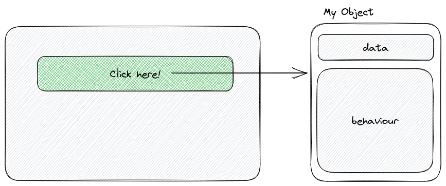
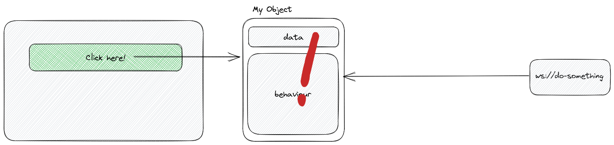
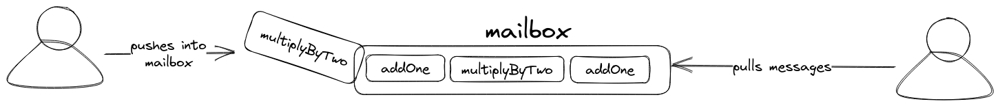
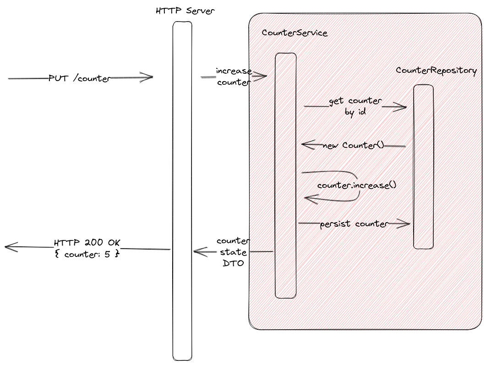
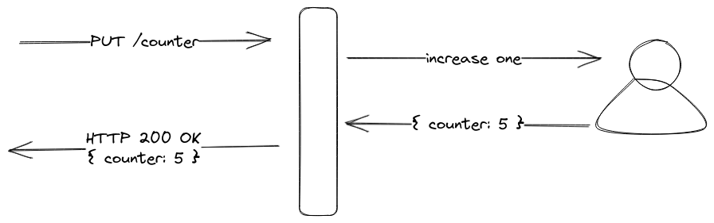

# Designing a Tarant Application

Tarant is a framework which has been designed for performance and easiness of development. However, it's based in the actor model, so some known design patterns 
change and there are alternatives that simplify the development of applications. In this tutorial, we will walkthrough over the design principles when working with
actors and tarant.

## What are actors?

First, let's start with the building blocks of tarant. A good understanding of what actors are is important to design an application with all the advantages of
the actor model.

An actor **is an object**, in the broader sense of the concept. An actor, as objects, contain both data and behaviour. However, what makes an actor different from
ordinary JavaScript objects? 

JavaScript objects are passive data structures: they only behave when a method is called on the object. Usually you will call an object method when your 
application is reacting to some user input.



An actor is **an active object**. Actors are there, interacting between each other, without any need of orchestration. An actor can just send messages[^1] to other 
actors. Also, actors can just behave without any stimulae, just running their own business logic, like for example, scheduled work.

But there are other differences too. For example, when you call a method on an object, you execute _a direct call_ to the object. The owner of the resources is the
caller of the object, not the object itself. If you have multiple threads running concurrently on the same object, you can have _race conditions_, which means,
modifying data concurrently (and likely corrupting it!). To avoid this to happen, objects need to implement different locking mechanisms that make reasoning about
the code pretty difficult.

But wait, we are in JavaScript. **JavaScript is single-threaded**, we can not have race conditions! That is *mostly* true, however, with async code things get
complex really quickly. Consider the following code in JavaScript:

```js
const simulateWork = async (forHowMuchTime) => await new Promise((resolve, _reject) => setTimeout(resolve, forHowMuchTime))
const randomTime = (from, to) => Math.floor(Math.random() * (to - from) + from)

class Counter {
    constructor() {
        this.number = 1
    }

    async addOne() {
        await simulateWork(randomTime(1000, 1500))
        this.number += 1
    }

    async multiplyByTwo() {
        await simulateWork(randomTime(800, 2000))
        this.number *= 2
    }
}

const counter = new Counter()

counter.addOne()
counter.multiplyByTwo()
counter.addOne()
counter.multiplyByTwo()
```

What is the result of counter at the end of the application? The answer is *it depends*. 

I ran the code a few times, sometimes the number was 12, 8, sometimes 10, and sometimes 6. Why?

* Sometimes the order is as follows:
  * addOne, addOne, multiplyByTwo, multiplyByTwo => 12
  * multiplyByTwo, addOne, addOne, multiplyByTwo => 8
  * addOne, multiplyByTwo, addOne, multiplyByTwo => 10

Even if we schedule the functions in order, because we are doing asynchronous code, the order of execution is not guaranteed!
So even in a single-threaded world, we can have race conditions! This is one of the most complex in lots of web applications
that require multiple calls to multiple backends.



However, for consistency, what would be the correct state? Actors ensure that any operations, independently of how much time they take, they are executed in order. An
actor **would ensure that the result is always 10** by design. This is the same code within an actor:

```js
const { Actor, ActorSystem } = require('tarant')

const simulateWork = async (forHowMuchTime) => await new Promise((resolve, _reject) => setTimeout(resolve, forHowMuchTime))
const randomTime = (from, to) => Math.floor(Math.random() * (to - from) + from)

class Counter extends Actor {
    constructor() {
        super()

        this.number = 1
    }

    async addOne() {
        await simulateWork(randomTime(1000, 1500))
        this.number += 1
    }

    async multiplyByTwo() {
        await simulateWork(randomTime(800, 2000))
        this.number *= 2
    }
}

const system = ActorSystem.default()
const counter = system.actorOf(Counter, [])

counter.addOne()
counter.multiplyByTwo()
counter.addOne()
counter.multiplyByTwo()
```

As you can see, an actor contains both the data and the behaviour like an ordinary class. And the code itself, is really similar. There are only two changes in the 
code that are important:

* Actors extend the `Actor` class from tarant.
* Actors must be instantiated through the actor system[^2].

But if they are like classes, how they ensure the correctness of the code? Actors are a little bit more complex than classes internally, but tarant encapsulates
all that.

When you call a method in an actor, you send a message to it's mailbox. A mailbox is the list of operations that has to be done by the actor. The actor will be
polling all messages in the mailbox, one by one, and in order of insertion. The actor guarantees that only processes one message at a time. A simple diagram of
how it works can help you visualise how everything works altogether:



However, as mentioned, all this complexity is hidden in the framework. You can still call your methods and wait for results, as you would do in ordinary 
JavaScript classes! This enables different patterns that we will explain later in the tutorial.

But wait, there are more differences between actors and objects. One of them is what we call **the lifecycle**.

Objects are ref-counted. It means that they only live during a transaction and are freed when no other object has a reference to them. Let's think in the following
scenario:



In the previous figure, the red area is the **lifecycle** of an object. In this case, the object is created in the repository, when we ask our database to retrieve
the latest state of the counter. Then, our CounterService (or any other orchestrator), will call a method on the object, update the state, and save it again in our
database. When the object is stored in the database, we return a copy of the object (for example, for serialization) and the copy is lost. The garbage collector will
eventually clean up the object.

However, the counter object still exists _in theory_. In our business, the _counter_ exists, we can just mutate it whenever we want, and get the state. What we created
during our transaction is `a representation of the counter` that lasts until the request is done. So every time we want to modify the counter, we have to create an
object, mutate it, and store it in the database.

An actor, but, is different. Actor is designed to share the same lifecycle of the business object it represents. The counter lives for an hour? Then the actor also.
The counter can live for a few years? Then so be it, the actor will also live for the same amount of time.

The same flow in tarant, would look like:



But, the question that you might have now is: what happens when I have billions of counters? An application might get out of memory easily. However, tarant can
**evict** actors, which means, releasing the memory used by the actor when the actor has been idle for a while. When the actor is used, tarant can **materialise**
the actor again so it can be used.

Using more persistent memory has important benefits, avoiding fragmentation and improving cacheability. However, this is taken already by tarant, you can just use it.

------


[^1] A message is how we call method calls to actors.

[^2] An Actor System is where all the actors live. We will dive later in the concept.